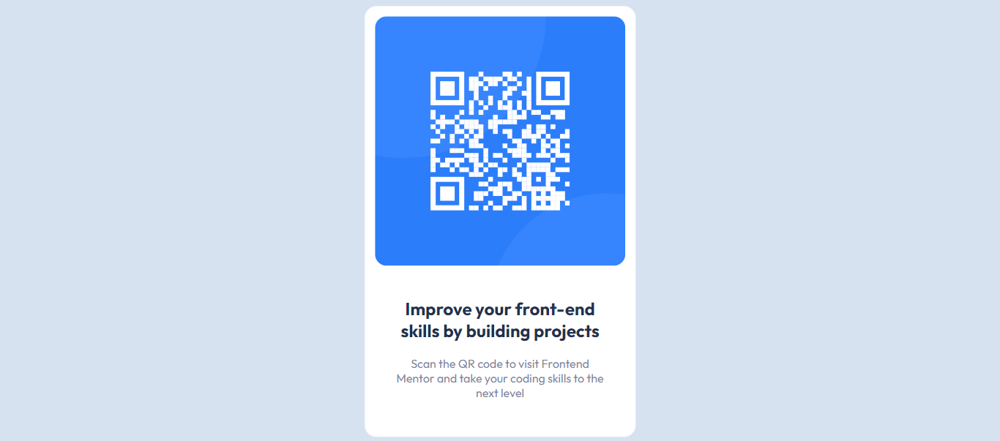

# Frontend Mentor - QR code component solution

This is a solution to the [QR code component challenge on Frontend Mentor](https://www.frontendmentor.io/challenges/qr-code-component-iux_sIO_H). Frontend Mentor challenges help you improve your coding skills by building realistic projects.

## Overview



### Links

- Solution URL: [QRcode component solution](https://github.com/chukwu777/qr-code-component.git)
- Live Site URL: [QRcode component live site](https://chukwu777.github.io/qr-code-component/)

## My process

### Built with

- HTML5
- SCSS

### What I learned

I learned how to center div vertically and horizontally.

```SCSS
.container {
  background: #ffffff;
  width: 25%;
  border-radius: 16px;
  position: absolute;
  top: 50%;
  left: 50%;
  transform: translate(-50%, -50%);
  padding: 14px;
}
```

### Continued development

I want to focus on Tailwind css and React js by building projects with it.

### Useful resources

- [11 Ways to Center a Div or Text in a Div in CSS](https://blog.hubspot.com/website/center-div-css) - This is an amazing article which helped me finally understand how to center div in many ways. I'd recommend it to anyone that find it difficult to center div.

## Author

- Website - [Emmanuel ifeanyichukwu chukwu](https://chukwu777.github.io/qr-code-component/)
- Frontend Mentor - [@chukwu777](https://www.frontendmentor.io/profile/chukwu777)
- Twitter - [@emmanuelic03](https://x.com/emmanuelic03)
- Tiktok - [@emmanuelic042](https://www.tiktok.com/@emmanuelic042)
